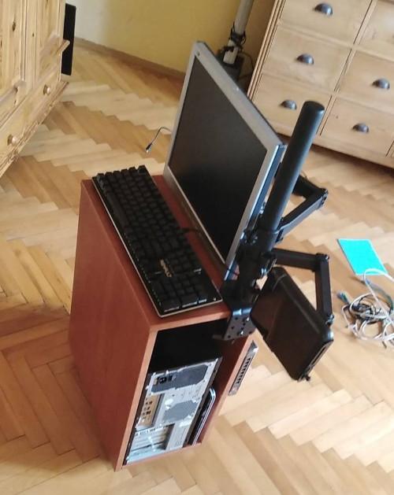
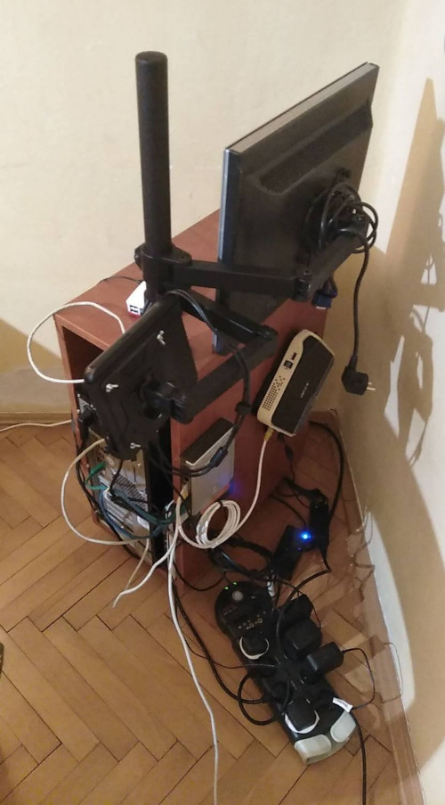
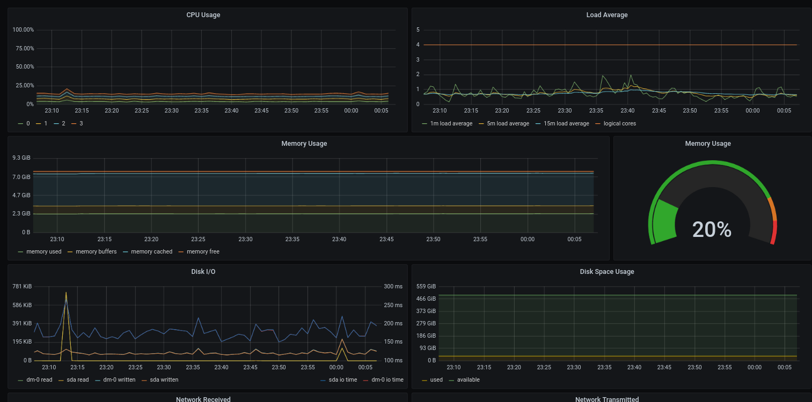

# 2021-04-12
I installed the cluster in its permanent location.

It now runs two apps and I've set up nginx ingress controller for an easy
access over a domain name.  Following the kube101 series, it was
straightforward to set up `cert-manager` and obtain TLS with Let's Encrypt. I
have some docs about this process in the [`tls`](tls) directory. I can now
access grafana over public internet. In future, I will explore how to limit the
access based on an IP and/or how to use VPS to mitigate some security holes I
might be opening by exposing services such as grafana.

# 2021-04-08
Last week I stumbled on a website which sells refurbished servers. I was
hooked. However, I figured that paying a few hundred pounds was not a smart
move as I had no idea what I was doing. Instead, I gathered some electronic
scrap I found around my parents' house: my old laptop, pi, some old computers,
cables tossed around in various dubious dark places, an old switch.

I experimented with Ubuntu server 20.04. I was pleasantly surprised with the
install wizard. It asked me for my Github username and then imported my SSH
keys. The wizard also suggested some default packages which helped me explore
my options. I installed `microk8s` and connected three machines in a cluster.
Straightforward. However, it drained my machines to their bones. 40% CPU usage
idle. It was the high availability feature, which replicated all data across 3
master nodes. I decided I would come back to this later and built an ugly case
which held all the machines.

For the effect, I included an old monitor.

I would be moving the cluster to another location, the basement, in a week.
Hopefully by then I will have figured out a less eye damaging cable work.

Now that the part scavenging and the drilling (to mount the parts) was over, I
dove into k8s. The high CPU usage I mentioned annoyed me. I experimented with
`k3s` as an alternative to `microk8s`. After a few hours I still I could not
get machines to connect into a cluster. With `microk8s` it was smooth. I
assumed there would be more issues with `k3s` even if I solved this one, so I
reverted back and decided to turn off the HA cluster feature I mentioned. The
compromise is that if the master node went down, I would lose data. I wasn't
sure what data specifically, but I suspected that everything which runs on the
master and all resource configs information such as pods, jobs, volumes, etc.

k8s seemed overwhelming at first and I was frankly lost with the `kubectl` CLI.
I watched some episodes of the [Jeff Geerling's 5 star Kube101
series](https://kube101.jeffgeerling.com). 2 hours in and I learnt that it was
hip to alias `kubectl` to `k`. Equipped with this primal knowledge I ported my
app, [suckless.hn](https://suckless.hn), to the cluster as a [cron
job](https://github.com/bausano/suckless.hn/tree/master/k8s). It took about 6
hours but having to write the config files, debug issues and setup the
environment was illuminating. Having some kind of feel for the aesthetic
zeitgeist k8s were born in, as of now I have cleared some uncertainty about
this technology going further.

Then I set up grafana, a k8s data visualization tool. Because who doesn't like
pretty graphs. It feeds off with data from prometheus, and connects out of the
box. All of that can be enabled with one command (see
[`MICROK8S.md`](MICROK8S.md)).

All this was a lot of work and many silly mistakes. On the plus side, I hope to
stop paying the AWS EC2 troll toll soon.

Next, I have to look into exposing the cluster access to public internet. I
access the machines over local IPs with my ssh key for now, but I will soon be
going back to my place outside of the cluster's local network. I have a public
IP at my parents' house, this won't be an issue. However, how to securely
expose grafana and the k8s dashboard? Stay tuned.

